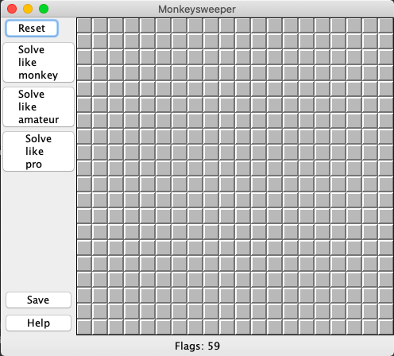
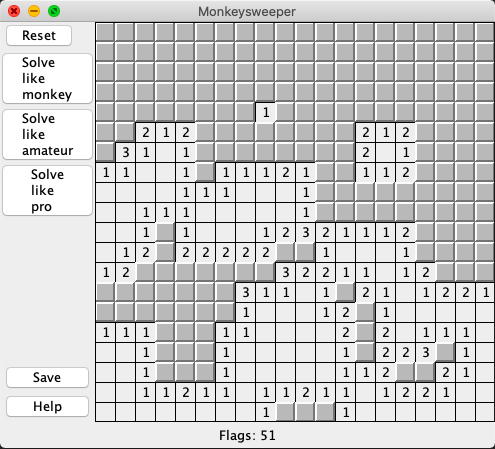

# Monkeysweeper

A simple monkeysweeper built with Java Swing and additional algorithms to solve the game like a human

## Description

Using probabilistic methods, this version of monkeysweeper comes with 3 different options of solving the game of increasing expertise.
Particularly, the solving algorithms use heuristics of different complexity to calculate the bomb probability of each square, and then chooses the one with lowest bomb probability in each iteration.<br> 
As a result, the algorithm of highest dexterity solves similar to how an expert solver would. Randomized over 1000 trials, its probability of completing the game is 72.8%, with the majority number of failed games from clicking a bomb in the exploration phase.     

## Getting Started

### Executing program

* Clone the github and change directory in the command line to this folder
* Run the following command in your terminal
```
javac -jar monkeysweeper.jar
```

## Help

The program may only work for MacOS. If it does not work for you, you can open the project in an editor of choice, and run the Game class. 


## Demo



[Watch the demo!](https://imgur.com/uKlErW2)

## Author

 [@Benjamin Le](bqle@seas.upenn.edu)


## Acknowledgments

* [Minesweeper](https://minesweeperonline.com/)
* [Ofri Raviv](https://stackoverflow.com/questions/1738128/monkeysweeper-solving-algorithm)
